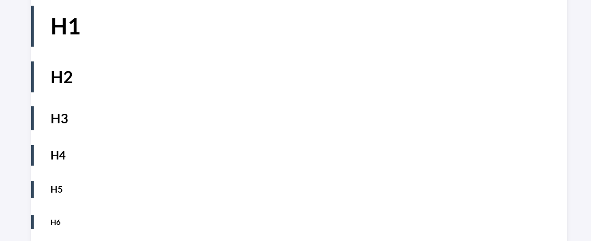

第一篇贴，熟悉一下博客怎么用。Markdown其实不算复杂，更有必要的是LaTeX的备忘录。（挖坑）
## 标题类

``` 
# H1
## H2
### H3
#### H4
##### H5
###### H6
```

渲染结果：



## 标记类

### 斜体-*italic*

```
*italic*
```
*A quick brown fox jumps over the lazy dog.*

*望着窗外，我想起了一句名言：有志者事竟成。*
### 加粗-**bold**

```
**bold**
```
**A quick brown fox jumps over the lazy dog.**

**望着窗外，我想起了一句名言：有志者事竟成。**

### 加粗斜体-***italic & bold***
```
*** italic & bold***
```
***A quick brown fox jumps over the lazy dog.***

***望着窗外，我想起了一句名言：有志者事竟成。***

### 删除线-~~delete~~
```
~~delete~~
```
~~A quick brown fox jumps over the lazy dog.~~

~~望着窗外，我想起了一句名言：有志者事竟成。~~

### 下划线-<u>underline</u>

Markdown原生不支持，可以使用HTML的``<u>``标签

```
<u> underline </u>
```
<u>A quick brown fox jumps over the lazy dog.</u>

<u>望着窗外，我想起了一句名言：有志者事竟成。</u>

### 高亮- ==highlight==

部分markdown编辑器支持。该博客原生不支持，但是开启goldmark extensions中的mark后即可以支持。
```
==highlight==
```
==A quick brown fox jumps over the lazy dog.==

==望着窗外，我想起了一句名言：有志者事竟成。==

### 冷门HTML标签

html是比markdown更加灵活的语言，通过CSS能够实现更自由的定制。Markdown中可使用html语句，而Markdown语句则可以单射为html语句。

#### 按键-<kbd>keyboard</kbd>

```
<kbd>keyvoard</kbd>
```
<kbd>A quick brown fox jumps over the lazy dog.</kbd>

<kbd>望着窗外，我想起了一句名言：有志者事竟成。</kbd>

#### 颜色-<span style="color : red">color</span>

```
<span style="color : red">color</span>
```

<span style="color : red">A quick brown fox jumps over the lazy dog.</span>

<span style="color : red">望着窗外，我想起了一句名言：有志者事竟成。</span>

> [!warning] incomplete
>   该文档未完成