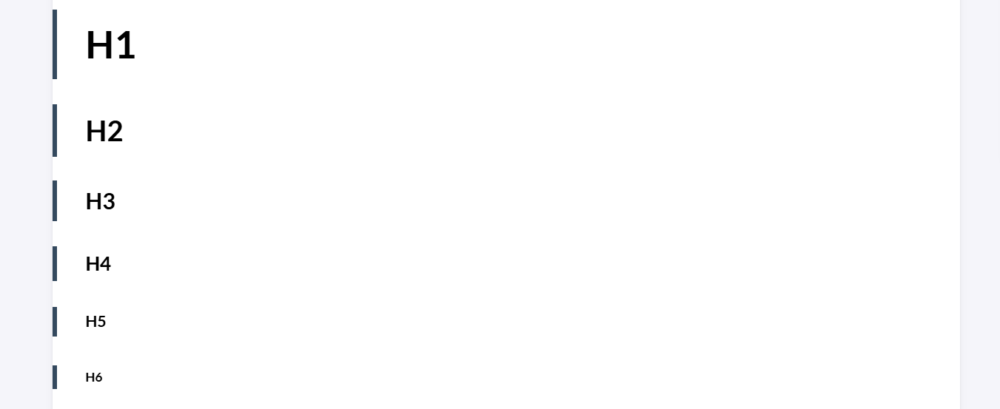

第一篇贴，熟悉一下博客怎么用。Markdown其实不算复杂，更有必要的是LaTeX的备忘录。（挖坑）
## 标题类
### 标题
``` 
# H1
## H2
### H3
#### H4
##### H5
###### H6
```

渲染结果：



### 分割线

```
---
***
```
渲染结果：
---
***

## 标记类

### 斜体-*italic*

```
*italic*
```
*A quick brown fox jumps over the lazy dog.*

*望着窗外，我想起了一句名言：有志者事竟成。*
### 加粗-**bold**

```
**bold**
```
**A quick brown fox jumps over the lazy dog.**

**望着窗外，我想起了一句名言：有志者事竟成。**

### 加粗斜体-***italic & bold***
```
*** italic & bold***
```
***A quick brown fox jumps over the lazy dog.***

***望着窗外，我想起了一句名言：有志者事竟成。***

### 删除线-~~delete~~
```
~~delete~~
```
~~A quick brown fox jumps over the lazy dog.~~

~~望着窗外，我想起了一句名言：有志者事竟成。~~

### 下划线-<u>underline</u>

Markdown原生不支持，可以使用HTML的``<u>``标签

```
<u> underline </u>
```
<u>A quick brown fox jumps over the lazy dog.</u>

<u>望着窗外，我想起了一句名言：有志者事竟成。</u>

### 高亮- ==highlight==

部分markdown编辑器支持。该博客原生不支持，但是开启goldmark extensions中的mark后即可以支持。
```
==highlight==
```
==A quick brown fox jumps over the lazy dog.==

==望着窗外，我想起了一句名言：有志者事竟成。==

### 冷门HTML标签

html是比markdown更加灵活的语言，通过CSS能够实现更自由的定制。Markdown中可使用html语句，而Markdown语句则可以单射为html语句。

#### 按键-<kbd>keyboard</kbd>

```
<kbd>keyboard</kbd>
```
<kbd>A quick brown fox jumps over the lazy dog.</kbd>

<kbd>望着窗外，我想起了一句名言：有志者事竟成。</kbd>

#### 颜色-<span style="color : red">color</span>

```
<span style="color : red">color</span>
```

<span style="color : red">A quick brown fox jumps over the lazy dog.</span>

<span style="color : red">望着窗外，我想起了一句名言：有志者事竟成。</span>

## 分点类

### 无序
```
* item1     - item1
* item2     - item2
* item3     - item3
```

* item1
* item2
* item3

### 有序
```
1. item1    1) item1
2. item2    2) item2
3. item3    3) item3
```
1. item1
2. item2
3. item3

### 无序复选框

```
* [ ] item1
* [x] item2
```

* [ ] item1
* [x] item2

### 有序复选框

```
1) [x] item1
2) [ ] item2
```

1) [x] item1
2) [ ] item2

## 其他功能块

### 代码块

```
    ``` <languages>
    Please code here.
    ```
```

``` Python
#Python
print("Hello World!") 
```

```c
//C
#include <stdio.h>
int main()
{
    printf("Hello World!");
    return 0;
}
```

```c#
//C#
Console.WriteLine("Hello World!");
```

### admonition

Stack不原生支持admonition。可以在custom.scss和layouts中新建render_blockquote.html进行实现。
该文档支持微软风格的admonition。MPE支持的admonition语法不同。这就是Markdown中存在的方言现象。
当然，该网站中的折叠admonition块为自造语法，Markdown不一定原生支持。

```
> [!tip] tips [+]
>   除了Markdown，还有定制程度更高、专业性更好的标记语言。
>   加号表示默认展开，减号表示默认折叠，该项缺省表示不折叠
```
> [!tip] tips [+]
>   除了Markdown，还有定制程度更高、专业性更好的标记语言。
>   加号表示默认展开，减号表示默认折叠，该项缺省表示不折叠

除了tip，支持的admonition type有如下

> [!info] info [-]
>   ``[!info] info [-]``


> [!warning] warning [-]
>   ``[!warning] warning [-]``


> [!danger] danger [-]
>   ``[!danger] danger [-]``


> [!success] success [-]
>   ``[!success] success [-]``


> [!note] note [-]
>   ``[!note] note [-]``


> [!todo] todo [-]
>   ``[!todo] todo [-]``


> [!question] question [-]
>   ``[!question] question [-]``


> [!important] important [-]
>   ``[!important] important [-]``


### 图片

```

```


### 超链接

```
[替代文字](https://www.example.com)
```

[Github网页地址](https://github.com)

### 注释

```
footnote[^1] and footnote [^2]
```
footnote[^1] and footnote [^2]

### 表格
```
| Title1 | Title2 | Title 3|
|:--|:--:|--:|
|Left-Aligned|Middle|Right-Aligned| 
```
| Title1 | Title2 | Title3 |
|:--|:--:|--:|
|居左|居中|居右| 

## *Stack特有的视频链接方法-shortcode

### BiliBili
> \{\{< bilibili VIDEO_ID PART_NUMBER >\}\}

例如，对于**https://www.bilibili.com/video/BV1d4411N7zD/?spm_id_from=333.337.search-card.all.click&vd_source=f1b2e107cd7459244d9edba74e777de5**，VIDEO_ID = **BV1d4411N7zD**



### Youtube
> \{\{< youtube VIDEO_ID >\}\}

例如，对于**https://www.youtube.com/watch?v=DYptgVvkVLQ&list=RDDYptgVvkVLQ&start_radio=1** ， VIDEO_ID=**DYptgVvkVLQ**



### 腾讯视频

> \{\{< tencent VIDEO_ID >\}\}

例如，对于**https://v.qq.com/x/cover/mzc0010012dzng9/w0026q7f01a.html**，VIDEO_ID=**w0026q7f01a**


### 普通视频

> \{\{\<video src=VIDEO_URL  autoplay="true" poster="path/to/poster.png">\}\}

### 插播：引用的shortcode

> \{\{< quote author="A famous person" source="The book they wrote" url="https://en.wikipedia.org/wiki/Book">\}\}
Lorem ipsum dolor sit amet, consectetur adipiscing elit, sed do eiusmod tempor incididunt ut labore et dolore magna aliqua. Ut enim ad minim veniam, quis nostrud exercitation ullamco laboris nisi ut aliquip ex ea commodo consequat. Duis aute irure dolor in reprehenderit in voluptate velit esse cillum dolore eu fugiat nulla pariatur. Excepteur sint occaecat cupidatat non proident, sunt in culpa qui officia deserunt mollit anim id est laborum.
\{\{< /quote >\}\}


Lorem ipsum dolor sit amet, consectetur adipiscing elit, sed do eiusmod tempor incididunt ut labore et dolore magna aliqua. Ut enim ad minim veniam, quis nostrud exercitation ullamco laboris nisi ut aliquip ex ea commodo consequat. Duis aute irure dolor in reprehenderit in voluptate velit esse cillum dolore eu fugiat nulla pariatur. Excepteur sint occaecat cupidatat non proident, sunt in culpa qui officia deserunt mollit anim id est laborum.



[^1]: 文章由Tobywangr写成
[^2]: 主题Stack由Jimmy设计